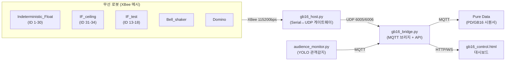

# 2026 Gwangju Biennale — 설치 제어 시스템 모노레포

이 저장소는 2026 광주비엔날레 설치 작품의 **임베디드 펌웨어(Teensy) + 중앙 호스트(Python/MQTT) + Pure Data 시퀀싱**을 모두 포함하는 모노레포입니다.

## 전체 아키텍처

## 폴더 구조

| 폴더 | 종류 | 역할 |
|---|---|---|
| [Indeterministic_Float/](Indeterministic_Float/) | PlatformIO (Teensy 4.0) | 본 설치 부유 로봇, 3축 장력 평형 액추에이터 (ID 1~30) |
| [IF_ceiling/](IF_ceiling/) | PlatformIO (Teensy 4.0) | 천장 설치형 변형 (ID 31~34), 스태거 없이 100% SMA 듀티 |
| [IF_test/](IF_test/) | PlatformIO (Teensy 4.1) | 테스트/개발용 변형 (ID 13~18), OLED 미사용 |
| [Bell_shaker/](Bell_shaker/) | PlatformIO (Teensy MicroMod) | Moteus 모터(CAN) 기반 종/타악 액추에이터 |
| [Domino/](Domino/) | PlatformIO (Teensy 4.0) | 솔레노이드 6채널 + PCA9685 서보 도미노 컨트롤러 |
| [hardware_test/](hardware_test/) | PlatformIO (Teensy 4.0) | SMA 컨트롤러 PCB v1.6 종합 진단(6 MOSFET + 듀얼 IR + OLED) |
| [tools/sensor_test/](tools/sensor_test/) | PlatformIO (Teensy 4.0) | 듀얼 MLX90614 + SSD1306 단독 검증용 |
| [gb16_host/](gb16_host/) | Python (systemd 서비스) | XBee ↔ UDP ↔ MQTT 중앙 브리지, 웹 대시보드, 관객감지, 전원 제어 |
| [tools/mqtt_monitor/](tools/mqtt_monitor/) | Python | 원격 MQTT 텔레메트리 모니터링/아카이브 |
| [tools/audio/](tools/audio/) | Shell | Pure Data ↔ JACK/PipeWire 오디오 라우팅 스크립트 (Mackie UltraLite) |
| [PD/GB16/](PD/GB16/) | Pure Data | 조명(Light)/시퀀서(Sequencer)/프리셋(Preset)/음향(Sound) 패치 |
| [gb16_host1/PD/](gb16_host1/PD/) | Pure Data | 공연 현장 호스트용 PD 자산 미러(백업/스테이징) |

> `Golden_Petals/`, `audio_shield/` 는 `.gitignore` 처리된 미완성/보류 폴더이며, `Hardware_Test/`(대문자)는 `hardware_test/`(소문자)로 대체된 빈 폴더입니다.

## 로봇 하드웨어 요약

| 프로젝트 | 로봇 ID | 보드 | 핵심 하드웨어 |
|---|---|---|---|
| Indeterministic_Float | 1–30 | Teensy 4.0 | SMA 4채널, MLX90614 IR센서 2개(별도 I2C), 냉각팬, 리드스위치 |
| IF_ceiling | 31–34 | Teensy 4.0 | 동일 하드웨어, 100% SMA 듀티(비스태거) |
| IF_test | 13–18 | Teensy 4.1 | 동일 하드웨어, OLED 제외, 온도범위 10~60°C |
| Bell_shaker | — | Teensy MicroMod | Moteus R4 모터(CAN, ACAN2517FD), XBee flag `0xB1` |
| Domino | — | Teensy 4.0 | 솔레노이드 6채널(핀 2~7), PCA9685 서보(I2C 0x40), XBee flag `0xD1` |
| hardware_test | — | Teensy 4.0 | MOSFET 6채널, MLX90614×2, SSD1306 OLED |

각 로봇의 상태 머신: `IDLE → HEATING(SMA) → SUSTAINING → COOLING → IDLE` (온도 목표 40~50°C, 하드 리밋 50°C, 4초 워치독).

## 통신 프로토콜

| 계층 | 프로토콜 | 설명 |
|---|---|---|
| 무선 | XBee (ZigBee) | 115200bps, 상태 패킷 23B / 명령 패킷 16B (프레임: `0xFF`...`0xFE`) |
| 로컬 | UDP | 상태 6005 / 명령 6006 (gb16_host.py ↔ gb16_bridge.py) |
| 클라우드 | MQTT | `gb16/robot/<id>/log`, `.../cmd`, `.../ack`, `gb16/power/group/<id>`, `gb16/cue`, `audience/present` 등 |
| 센서 | I2C | 보드당 다중 버스(Wire/Wire2/Wire3)로 간섭 방지 |
| 모터 | CAN | Bell_shaker 전용, Moteus 컨트롤러 |
| 디스플레이 | I2C | SSD1306 OLED (SMA 컨트롤러 PCB 탑재 보드) |

## gb16_host (중앙 제어 호스트)

- `gb16_host.py` — XBee 시리얼 ↔ UDP 게이트웨이
- `gb16_bridge.py` — UDP ↔ MQTT 포워더, 텔레메트리 DB, HTTP API(8182)
- `audience_monitor.py` — Tapo C200 카메라 YOLOv8n 관객감지
- `gb16_control.html` — 실시간 로봇 상태/카메라/프리셋 제어 웹 대시보드
- 배포: 사용자 systemd 서비스(`gb16-host`, `gb16-bridge`, `gb16-audience`), 설정은 `.env` (예시: `gb16_host/.env.example`)

자세한 내용은 [gb16_host/README.md](gb16_host/README.md) 참고.

## Pure Data 시퀀싱

[PD/GB16/](PD/GB16/) 아래 `Light/`(DMX 조명), `Sequencer/`(타이밍/트리거, MQTT `gb16/cue` 구독), `Preset/`(RSVP vanilla 기반 프리셋 저장, 자세한 내용은 [PD/GB16/Preset/README.md](PD/GB16/Preset/README.md)), `Sound/`(오디오 샘플)로 구성됩니다.

## 개발 환경

- 각 펌웨어 프로젝트는 PlatformIO 프로젝트이며 VS Code 확장으로 빌드/업로드합니다. PlatformIO 관련 이슈는 [PLATFORMIO_TROUBLESHOOTING.md](PLATFORMIO_TROUBLESHOOTING.md) 참고.
- 전체 폴더는 [2026_GwangjuBiennale.code-workspace](2026_GwangjuBiennale.code-workspace) 멀티루트 워크스페이스로 관리됩니다.
