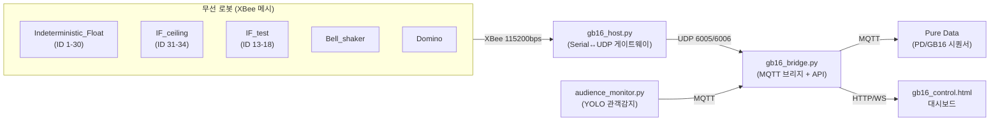

# 2026 Gwangju Biennale — 설치 제어 시스템 모노레포

이 저장소는 2026 광주비엔날레 설치 작품의 **임베디드 펌웨어(Teensy) + 중앙 호스트(Python/MQTT) + Pure Data 시퀀싱**을 모두 포함하는 모노레포입니다.

## 전체 아키텍처

## 폴더 구조

| 폴더 | 종류 | 역할 |
|---|---|---|
| [Indeterministic_Float/](Indeterministic_Float/) | PlatformIO (Teensy 4.0) | 본 설치 부유 로봇, 3축 장력 평형 액추에이터 (ID 1~30) |
| [IF_ceiling/](IF_ceiling/) | PlatformIO (Teensy 4.0) | 천장 설치형 변형 (ID 31~34), 스태거 없이 100% SMA 듀티 |
| [IF_test/](IF_test/) | PlatformIO (Teensy 4.1) | 테스트/개발용 변형 (ID 13~18), OLED 미사용 |
| [Bell_shaker/](Bell_shaker/) | PlatformIO (Teensy MicroMod) | Moteus 모터(CAN) 기반 종/타악 액추에이터 |
| [Domino/](Domino/) | PlatformIO (Teensy 4.0) | 솔레노이드 6채널 + PCA9685 서보 도미노 컨트롤러 |
| [hardware_test/](hardware_test/) | PlatformIO (Teensy 4.0) | SMA 컨트롤러 PCB v1.6 종합 진단(6 MOSFET + 듀얼 IR + OLED) |
| [tools/sensor_test/](tools/sensor_test/) | PlatformIO (Teensy 4.0) | 듀얼 MLX90614 + SSD1306 단독 검증용 |
| [gb16_host/](gb16_host/) | Python (systemd 서비스) | XBee ↔ UDP ↔ MQTT 중앙 브리지, 웹 대시보드, 관객감지, 전원 제어 |
| [tools/mqtt_monitor/](tools/mqtt_monitor/) | Python | 원격 MQTT 텔레메트리 모니터링/아카이브 |
| [tools/audio/](tools/audio/) | Shell | Pure Data ↔ JACK/PipeWire 오디오 라우팅 스크립트 (Mackie UltraLite) |
| [PD/GB16/](PD/GB16/) | Pure Data | 조명(Light)/시퀀서(Sequencer)/프리셋(Preset)/음향(Sound) 패치 |

> `Golden_Petals/`, `audio_shield/` 는 `.gitignore` 처리된 미완성/보류 폴더이며, `Hardware_Test/`(대문자)는 `hardware_test/`(소문자)로 대체된 빈 폴더입니다. (예전에 있던 `gb16_host1/`은 `PD/GB16/`의 중복 미러 사본이라 제거했습니다.)

## 로봇 하드웨어 요약

| 프로젝트 | 로봇 ID | 보드 | 핵심 하드웨어 |
|---|---|---|---|
| Indeterministic_Float | 1–30 | Teensy 4.0 | SMA 4채널, MLX90614 IR센서 2개(별도 I2C), 냉각팬, 리드스위치 |
| IF_ceiling | 31–34 | Teensy 4.0 | 동일 하드웨어, 100% SMA 듀티(비스태거) |
| IF_test | 13–18 | Teensy 4.1 | 동일 하드웨어, OLED 제외, 온도범위 10~60°C |
| Bell_shaker | — | Teensy MicroMod | Moteus R4 모터(CAN, ACAN2517FD), XBee flag `0xB1` |
| Domino | — | Teensy 4.0 | 솔레노이드 6채널(핀 2~7), PCA9685 서보(I2C 0x40), XBee flag `0xD1` |
| hardware_test | — | Teensy 4.0 | MOSFET 6채널, MLX90614×2, SSD1306 OLED |

각 로봇의 상태 머신: `IDLE → HEATING(SMA) → SUSTAINING → COOLING → IDLE` (온도 목표 40~50°C, 하드 리밋 50°C, 4초 워치독).

## 개별 로봇 기능 상세

### Indeterministic_Float / IF_ceiling / IF_test — 유영(부유) 로봇

SMA(형상기억합금) 와이어를 저항 가열해 3축 장력을 변화시켜 부유·유영 동작을 만드는 로봇입니다. 두 개의 MLX90614 적외선 센서로 각 SMA 축의 온도를 실시간 측정해 균형을 유지합니다.

- **XBee 명령**: `RESET`, `HEAT_ON`, `HEAT_OFF`, `FAN_ON speed=n`, `FAN_OFF`, `SET`(파라미터 적용), `PRESET:n`, `SOUND:n`
- **프리셋(PRESET:n) 동작 목록**:
  | 번호 | 동작 |
  |---|---|
  | 1 | 정지 |
  | 2 | 유영 (기본) |
  | 3 | 느린 유영 |
  | 4 | 힘찬 유영 |
  | 5 | 숨고르기 |
  | 6 | 순차 재생 — 2→3→4번을 2분(`SEQ_PRESET_DURATION_MS`)마다 순환 |
  | 7 | 랜덤 재생 — 2/3/4번 중 무작위로 2분마다 전환 |
- **사운드(SOUND:n)**: `0`=정지, `1`=사운드1 1회, `2`=사운드1 루프, `3`=사운드2 1회, `4`=사운드2 루프
- **차이점**: IF_ceiling은 스태거 없이 SMA 100% 듀티(천장 고정이라 전류 여유), IF_test는 OLED 미사용 + 온도범위 10~60°C로 넓게 설정된 개발용 변형

### Bell_shaker — 종/타악 액추에이터

Moteus R4 모터 컨트롤러(CAN)로 진자/타격 모션을 구동합니다. XBee 시리얼 명령 `'1'`=회전 시작, `'0'`=정지. 내부에 속도 모드 3단계(기본 2.8turn/s·고속·최대) 및 8종 프리셋이 있고, 프리셋마다 역회전 주기(0.7~15Hz)와 전류 제한이 달라 다른 타격감을 냅니다.

### Domino — 솔레노이드 도미노 컨트롤러

6개의 솔레노이드(MOSFET, 핀 2~7)로 도미노를 쓰러뜨리고, PCA9685 서보 드라이버로 도미노를 자동으로 다시 세웁니다.

- **시리얼/XBee 명령**: `1~6`(개별 도미노 솔레노이드), `7`/`a`(전체 솔레노이드, 60ms 스태거 간격), `11~16`(개별 서보 raise-only), `17`(전체 서보 raise-only), `r`(전체 서보 홈 리셋)
- **서보 시퀀스**: 홈(2650µs) → 1.5초 sweep → 세움(1950µs) → 1초 유지 → 0.5초 sweep → 홈 복귀
- **I2C 안정성**: PCA9685 헬스체크를 500ms 주기로 수행, 연결 끊김 감지 시 자동 재초기화 및 전체 서보 홈 리셋 (`checkI2CHealth()`)

## 통신 프로토콜

| 계층 | 프로토콜 | 설명 |
|---|---|---|
| 무선 | XBee (ZigBee) | 115200bps, 상태 패킷 23B / 명령 패킷 16B (프레임: `0xFF`...`0xFE`) |
| 로컬 | UDP | 상태 6005 / 명령 6006 (gb16_host.py ↔ gb16_bridge.py) |
| 클라우드 | MQTT | `gb16/robot/<id>/log`, `.../cmd`, `.../ack`, `gb16/power/group/<id>`, `gb16/cue`, `audience/present` 등 |
| 센서 | I2C | 보드당 다중 버스(Wire/Wire2/Wire3)로 간섭 방지 |
| 모터 | CAN | Bell_shaker 전용, Moteus 컨트롤러 |
| 디스플레이 | I2C | SSD1306 OLED (SMA 컨트롤러 PCB 탑재 보드) |

## gb16_host (중앙 제어 호스트)

- `gb16_host.py` — XBee 시리얼 ↔ UDP 게이트웨이
- `gb16_bridge.py` — UDP ↔ MQTT 포워더, 텔레메트리 DB, HTTP API(8182)
- `audience_monitor.py` — Tapo C200 카메라 YOLOv8n 관객감지
- `gb16_control.html` — 실시간 로봇 상태/카메라/프리셋 제어 웹 대시보드
- 배포: 사용자 systemd 서비스(`gb16-host`, `gb16-bridge`, `gb16-audience`), 설정은 `.env` (예시: `gb16_host/.env.example`)

자세한 내용은 [gb16_host/README.md](gb16_host/README.md) 참고.

### 제어 페이지(gb16_control.html) 상세 기능

웹 브라우저(모바일 포함)로 접속하는 실시간 제어 대시보드이며, 페이지 안에 운영자용 **📋 스텝 매뉴얼**과 **🧰 수리 상세 매뉴얼**이 내장되어 있습니다.

- **그룹 선택**: 전체 34대 / 유영 전체(IF, R01–R30) / 천장(IF Ceiling, R31–R34) / 해제
- **파라미터 패널**: IF·IF Ceiling 탭별로 목표온도·팬 속도 등 값을 조정 후 [📋 SET 전송]으로 반영
- **명령 버튼**: `🔥 HEAT_ON`(SET 후 가열 시작), `❄ HEAT_OFF`, `⛔ RESET`(확인창 후 전송), `💨 FAN_ON` / `🚫 FAN_OFF`, `🎲 스태거드 시작` / `⏹ 스태거드 중단`(그룹 내 로봇을 순차 지연 기동해 전류 피크 분산)
- **프리셋 버튼**: IF용 `PRESET:1~4`를 선택된 그룹에 일괄 전송
- **공연 제어**: `▶ 시작`/`⏹ 전체 스톱`(전체 로봇 정지 + 사운드 정지 + RESET 재전송 + 2초 후 RESET 재확인)
- **커스텀 타임라인**: 시간·대상·동작을 지정한 스텝을 추가(`＋ 스텝 추가`)·정렬(`↕ 시간순 정렬`)해 시퀀스를 구성, `▶ 실행`/`⏹ 중단`으로 수동 제어
- **관객감지 자동 실행**: `audience/present` MQTT 신호가 없음→있음으로 바뀌는 순간 커스텀 타임라인을 1회 자동 실행 (ON/OFF 토글, 그룹별 자동리셋 체크박스 포함, 쿨다운 2분)
- **전원 제어(Tapo P110M 스마트 플러그, 개별 ON/OFF/↺재시작)**:
  | 번호 | 담당 장치 |
  |---|---|
  | 1 | IF + Bell_shaker + Light1 (192.168.0.100) |
  | 2 | Domino (192.168.0.101) |
  | 3 | IF Ceiling + Light2 (192.168.0.102) |

  `전시 시작`(전체 ON) / `전시 마감`(확인창 후 전체 OFF) 버튼으로 일괄 제어 가능
- **사운드 수동 제어**: 트랙 `♪1~4` 직접 재생, `■ STOP`(10초 페이드아웃), 볼륨 슬라이더(기본값 70)
- **조명 제어 패널**: `⬛ BLACKOUT`, `↺ 자동 복귀`, 그룹별 프리셋(꽃만개/꽃대기/유영최대/유영대기/아해들밝음/아해들어둠 — RGBW 값 프리셋), 조명 테스트 GUI 실행 버튼
- **PD 큐 연동**: `📡 Pd 큐` 토글로 Pure Data 컴퓨터에 큐를 전송하도록 설정, 저장/테스트 가능
- **로봇 상태 카드**: IDLE(대기)/HEAT🔥(가열)/SUST(유지)/COOL❄(냉각)/ERR⚠(오류, 전원 재시작 필요) 표시, 흐릿한 카드는 오프라인(연결 끊김)
- **명령 로그 / 에러 로그 패널**: 전송 명령 이력 표시, 에러 로그는 새 창 전체보기·지우기 지원
- **접속 정보 패널**: 외부(모바일 데이터 포함 어디서나) / 내부(전시장 Wi-Fi 전용) 접속 URL 복사 버튼 제공

## Pure Data 시퀀싱

[PD/GB16/](PD/GB16/) 아래 `Light/`(DMX 조명), `Sequencer/`(타이밍/트리거, MQTT `gb16/cue` 구독), `Preset/`(RSVP vanilla 기반 프리셋 저장, 자세한 내용은 [PD/GB16/Preset/README.md](PD/GB16/Preset/README.md)), `Sound/`(오디오 샘플)로 구성됩니다.

## 개발 환경

- 각 펌웨어 프로젝트는 PlatformIO 프로젝트이며 VS Code 확장으로 빌드/업로드합니다. PlatformIO 관련 이슈는 [PLATFORMIO_TROUBLESHOOTING.md](PLATFORMIO_TROUBLESHOOTING.md) 참고.
- 전체 폴더는 [2026_GwangjuBiennale.code-workspace](2026_GwangjuBiennale.code-workspace) 멀티루트 워크스페이스로 관리됩니다.
